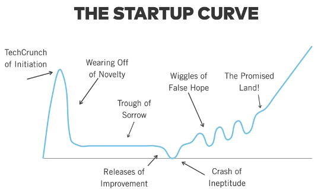

## Resources

    Read [Paul Graham’s article "Startup = Growth"](http://www.paulgraham.com/growth.html） to get a better sense of what makes a startup different than a traditional company, and why investors like startups.
    [One Month's Y Combinator Demo Day pitch](https://www.youtube.com/watch?v=TI2V5sgYAPE&feature=youtu.be) in case you're curious.

## 1. I'll let you into some of my Growth Hacking secrets...

    Often you’ll hear the term "hockey stick graph" or "up and to the right" when you talk with startups. It’s this idea of starting slow, and then massively accelerating.
    In the beginning, your growth might not feel smooth

## 2. Stages of the Startup Curve 
    
    

    TechCrunch of initiation
    Wearing off of novelty
    Trough of sorrow...
    Release of improvements
    Crash of ineptitude
    Wiggles of false hope
    The promise land!

